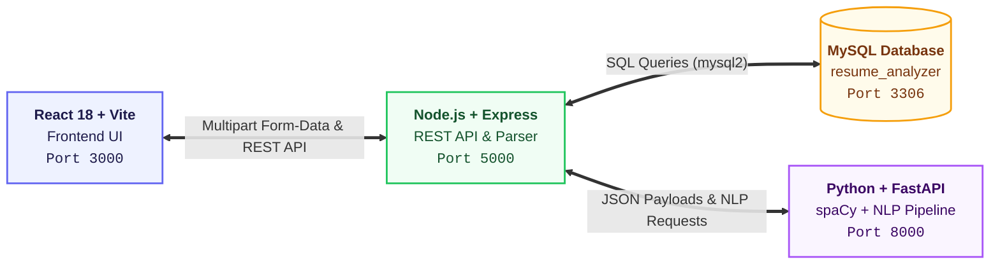

# 🤖 AstraAI — Resume Analyzer with Intelligent Job Recommendation

A full-stack AI-powered web application that provides **automated career intelligence and ATS evaluation** by analyzing resumes against job descriptions using **NLP** and **Machine Learning**.

Upload your resume in any format, select a target role or explore universal market readiness, and instantly receive a match score, skill gap analysis, resume strength rating, executive ATS assessment report, and personalized career roadmaps.

---

## ✨ Key Features

| Feature | Description |
|---|---|
| **Multi-Format Support** | Seamless text extraction for **PDF, Word (DOCX/DOC), TXT, RTF, and Markdown** using `mammoth` and native stream parsers. |
| **Cascading Job Selector** | 2-level cascading selector: filter by **Industry Sector / Domain** (Tech, Finance, Healthcare, Marketing, HR, Operations, Design, Legal, Engineering) then select a **Specific Job Role**. |
| **Hybrid ATS Match Engine** | Blends 70% direct technical skill overlap with 30% TF-IDF full-text contextual semantic similarity for realistic ATS grading. |
| **Dual General & Global Market Fit** | When no specific job is chosen, calculates both **Primary Domain Best Fit** (0–100%) and **Global Multi-Sector Market Fit** across 54+ industry roles. |
| **Skill Gap & Extracted Skills** | Real-time gap detection showing missing essential skills alongside extracted competencies from a 100+ multi-industry gazetteer. |
| **Experience & Seniority Parsing** | Automatically extracts total years of experience, inferred seniority level, and previous job titles with company and date ranges. |
| **Executive ATS Report & PDF Export** | Toggle between an interactive web dashboard and a formal, printable **Executive ATS Assessment Report** optimized for clean A4 PDF export. |
| **Dual Mode UI** | **Individual Mode** for self-assessment, and **Organization Dashboard** for recruiters to bulk upload, rank, and evaluate candidate pools. |

---

## 🏗️ Architecture



```
┌──────────────────┐       ┌────────────────────┐       ┌─────────────────────┐
│                  │       │                    │       │                     │
│   React + Vite   │──────▶│  Node.js + Express │──────▶│  Python + FastAPI   │
│   (Frontend)     │◀──────│  (Backend API)     │◀──────│  (ML Microservice)  │
│   Port 3000      │       │  Port 5000         │       │  Port 8000          │
│                  │       │                    │       │                     │
└──────────────────┘       └─────────┬──────────┘       └─────────────────────┘
                                     │
                            ┌────────▼───────────┐
                            │                    │
                            │   MySQL Database   │
                            │   resume_analyzer  │
                            │   Port 3306        │
                            │                    │
                            └────────────────────┘
```

### Tech Stack

| Layer | Technology |
|---|---|
| **Frontend** | React 18 · Tailwind CSS 3 · Vite 5 · Framer Motion · Recharts · Lucide Icons |
| **Backend API** | Node.js · Express.js · Multer · `pdf-parse` · `mammoth` · `mysql2` |
| **ML Microservice** | Python 3.9+ · FastAPI · Uvicorn |
| **NLP / ML** | spaCy (`en_core_web_sm`) · scikit-learn (TF-IDF Vectorizer + Cosine Similarity) · Regex Pattern Matcher |
| **Database** | MySQL 8.0+ (`Users`, `Jobs`, `Resumes`, `Analysis_History`) |

---

## 📁 Project Structure

```
AI_Resume_Analyzer/
├── frontend/                 # React + Vite frontend
│   ├── src/
│   │   ├── App.jsx           # Main application (Individual + Organization modes, Executive Report)
│   │   ├── index.css         # Global styles, @media print styles, animations
│   │   └── main.jsx          # React entry point
│   ├── index.html            # HTML shell
│   ├── tailwind.config.js    # Tailwind configuration
│   ├── vite.config.js        # Vite configuration
│   └── package.json
│
├── backend/                  # Node.js REST API
│   ├── server.js             # Express server, multi-format file extraction, ML proxy
│   ├── .env                  # Environment variables (gitignored)
│   ├── .env.example          # Template for environment setup
│   ├── uploads/              # Temporary upload directory (auto-cleaned safely)
│   └── package.json
│
├── ml_service/               # Python ML microservice
│   ├── main.py               # FastAPI app, NLP pipeline, multi-sector gazetteers, scoring formulas
│   └── requirements.txt      # Python dependencies
│
├── database/                 # MySQL schema and seed data
│   ├── schema.sql            # Tables: Users, Jobs, Resumes, Analysis_History
│   └── seed.sql              # 50+ pre-configured job roles across multiple industry domains
│
├── .gitignore                # Git ignore rules for node_modules, .env, and temporary files
└── README.md
```

---

## 🚀 Quick Start

### 0. Clone the Repository

```bash
git clone https://github.com/SartazEAlam/AstraAI-AI_Resume_Analyzer.git
cd AstraAI-AI_Resume_Analyzer
```

### Prerequisites

- **Node.js** v18+ and npm
- **Python** 3.9+
- **MySQL** 8.0+

### 1. Database Setup

```bash
mysql -u root -p < database/schema.sql
mysql -u root -p < database/seed.sql
```

This creates the `resume_analyzer` database and populates job roles across Tech, Finance, Healthcare, Marketing, Operations, and Engineering.

### 2. ML Service (Terminal 1)

```bash
cd ml_service
pip install -r requirements.txt
python -m spacy download en_core_web_sm
uvicorn main:app --reload --port 8000
```

The ML service will be live at `http://localhost:8000`.

### 3. Backend API (Terminal 2)

```bash
cd backend
cp .env.example .env
# Edit .env and configure your MySQL credentials (DB_PASSWORD)
npm install
npm run dev
```

The backend API will be live at `http://localhost:5000`.

### 4. Frontend (Terminal 3)

```bash
cd frontend
npm install
npm run dev
```

Open **http://localhost:3000** in your browser.

---

## ⚙️ Environment Variables

Create `backend/.env` based on `backend/.env.example`:

```env
# Server
PORT=5000

# MySQL Database
DB_HOST=localhost
DB_PORT=3306
DB_USER=root
DB_PASSWORD=your_mysql_password
DB_NAME=resume_analyzer

# Python ML Microservice
ML_SERVICE_URL=http://localhost:8000
```

---

## 🔌 API Endpoints

### Backend (Node.js — Port 5000)

| Method | Endpoint | Description |
|--------|----------|-------------|
| `GET` | `/api/health` | Health check endpoint |
| `GET` | `/api/jobs` | Retrieve all job roles categorized by sector |
| `POST` | `/api/upload` | Upload resume file (`.pdf`, `.docx`, `.doc`, `.txt`, `.rtf`, `.md`) + optional `jobId` |

---

## 🧠 How the Scoring & ML Pipeline Works

1. **Multi-Format Text Extraction**
   - Automatically detects MIME type / file extension. Uses `pdf-parse` for PDFs and `mammoth` for DOCX/DOC documents, with UTF-8 stream fallback for text/markdown files.

2. **Skill Extraction & Multi-Sector Gazetteer**
   - Combines spaCy tokenization with regex matching across comprehensive technical and business skill taxonomies.

3. **Experience & Timeline Parsing**
   - Parses dates, titles, seniority keywords (Fresher, Mid-Level, Senior, Lead), and previous employers.

4. **Hybrid Target Job Matching Formula**
   - When a target job is selected, the **Target Job Match** score is computed as:
     $$\text{Target Job Match} = (70\% \times \text{Skill Match Ratio}) + (30\% \times \text{TF-IDF Cosine Similarity})$$
   - **Target Skill Match**: Measures direct required keyword coverage ($\frac{\text{Matched Skills}}{\text{Total Required Skills}}$).

5. **Universal Market Fit (No Target Job Selected)**
   - **Primary Domain Fit (0–100%)**: Evaluates fit against candidate's single best-matching discipline.
   - **Global Market Fit**: Quantifies overall versatility across all 54 roles in all sectors.

---

## 🖥️ UI Modes & Features

### 👤 Individual Mode
- **Dual View**: Switch between **📊 Interactive Dashboard** and **📄 Executive ATS Report**.
- **Score Rings**: Horizontally aligned metrics for Target Job Match, Resume Strength, and Skill Coverage.
- **Skill Gaps & Recommendations**: Highlights missing competencies and suggests 3 alternative career tracks.
- **One-Click Print/Export**: Clean `@media print` layout creates pristine, watermark-free PDF evaluation sheets.

### 🏢 Organization Dashboard
- **Recruiter Batch Upload**: Upload dozens of candidate resumes at once.
- **Role Ranking Table**: Sort candidates by match %, strength score, and experience years.
- **Detailed Candidate Modal**: Inspect individual breakdowns or generate an executive audit report for any applicant.

---

## 🛠️ Development Scripts

```bash
# Frontend dev server (Vite hot reload)
cd frontend && npm run dev

# Backend dev server (Nodemon auto-reload)
cd backend && npm run dev

# ML Microservice (Uvicorn auto-reload)
cd ml_service && uvicorn main:app --reload --port 8000
```

---

## 📝 License

This project is licensed under the MIT License — built for professionals and educational demonstration.
